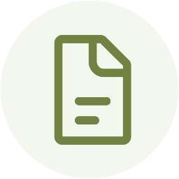

  

  <h1>IStanPdf</h1>

  

    <strong>Offline PDF & DOCX operations. No paywalls. No internet. No nonsense.</strong>
     
    <em>Built to counter freemium online pdf and docx services.</em>
  

  

    <a href="#-features"><b>Features</b></a> •
    <a href="#-download"><b>Download</b></a> •
    <a href="#-known-issues"><b>Known Issues</b></a> •
    <a href="#-contributing"><b>Contributing</b></a>
  

**IStanPdf** is an offline Android utility for PDF and DOCX operations — no internet required, no subscription, no file size limits. It was born out of frustration with the slow upload speeds and freemium paywalls of tools like iLovePDF and Smallpdf. Everything runs on your device.

---

## ✨ Features

<table>
  <tr>
    <td width="50%" valign="top">
      

        <h3>📄 PDF Tools</h3>
        <ul>
          <li><b>Merge PDF:</b> Combine multiple PDF files into one.</li>
          <li><b>Split PDF:</b> Extract pages by specifying a page range.</li>
          <li><b>Remove Pages:</b> Delete specific pages from a PDF.</li>
          <li><b>Reorder Pages:</b> Rearrange pages within a PDF.</li>
        </ul>
      

    </td>
    <td width="50%" valign="top">
      

        <h3>🔄 Conversions</h3>
        <ul>
          <li><b>Images to PDF:</b> Convert one or more images into a single PDF document.</li>
          <li><b>PDF to Image:</b> Extract PDF pages and save them as images.</li>
        </ul>
      

    </td>
  </tr>
  <tr>
    <td width="50%" valign="top">
      

        <h3>📝 DOCX Tools</h3>
        <ul>
          <li><b>Remove Pages:</b> Delete specific pages from a DOCX file.</li>
          <li><b>Reorder Pages:</b> Rearrange pages within a DOCX file.</li>
        </ul>
      

    </td>
    <td width="50%" valign="top">
      

        <h3>🔒 Privacy & Offline</h3>
        <ul>
          <li>Fully offline — your files never leave your device.</li>
          <li>No account required.</li>
          <li>No ads, no paywalls, no upload limits.</li>
        </ul>
      

    </td>
  </tr>
</table>

---

## 📥 Download

<table>
  <thead>
    <tr>
      <th align="center">GitHub Releases</th>
    </tr>
  </thead>
  <tbody>
    <tr>
      <td align="center">
        
      </td>
    </tr>
  </tbody>
</table>

## ⚠️ Known Issues

- **DOCX Remove Pages:** Some DOCX files with structural issues fail to save during the "Remove Pages" operation.
  - **Workaround:** Use "Reorder Pages" instead — it internally converts the DOCX to PDF to bypass the limitation.
  - **Caveat:** If you later convert the resulting PDF back to DOCX, some elements may no longer be editable.

- **App Size:** IStanPdf is larger than a typical utility app because it bundles LibreOffice binaries, which power the DOCX operations.

- **UI:** The interface is functional but not fully polished yet. Micro-optimizations for accessibility are planned.
- **Monolith Architecture:** Every operation code is in singleton MainActivity.It is easier to code but to hard to debug and update changes.I'll refactor the app in later updates to use different architecture for development.

---

## 📋 TODOs

- [ ] **Refactor Architecture:** Refactor code from monolith to a better architecture for easier debugging.
- [ ] **Compress PDF:** Introduce Compress PDF feature.
- [ ] **Optimize DOCX:** Optimize DOCX operations.
- [ ] **Auto DOCX Repair:** Introduce auto DOCX Repair feature to fix structural issues in DOCX making it difficult to be saved.

---

## 💡 Why IStanPdf?

As a 1st-year CS Engineering student, I found myself constantly needing PDF and DOCX tools — and constantly hitting paywalls or waiting for slow cloud uploads. No offline app I found handled both well enough. So I built one.

### Why Vibecoding?

Vibecoding doesn't mean you don't know how it's done. I am a 1st-year CS Engineering Student, and I am actively learning. My ultimate aim is to manually code everything and eventually ditch vibecoding. 

| As a Friend 🤝 | As a Foe ⚔️ |
| :--- | :--- |
| Writes code rapidly | Introduces bugs frequently |
| Turns imagination into reality | Takes time to debug |
| Great for prototyping | Hallucinates often |

---

## 🛠️ Development

| Tool | Purpose |
| :--- | :--- |
| **Antigravity 2.0** | Development |
| **Codex** | Development |
| **ChatGPT Image Generation** | UI Design |

---

## 🤝 Contributing

Issues, bug reports, and Pull Requests are welcome! If something doesn't work as expected, open an issue and let's fix it together.

---

## ☕ Donate

If IStanPdf has been useful to you, consider supporting its development!

  

## 🏆 Credits

- **iLovePDF & Smallpdf** — For inspiring the overall UI and design direction.
- **LibreOffice** — The engine powering all DOCX operations under the hood.

---

  
<b>If you find this app useful, consider giving it a ⭐</b>

---
